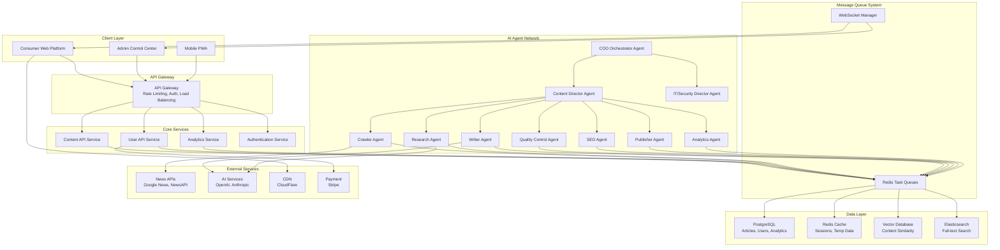
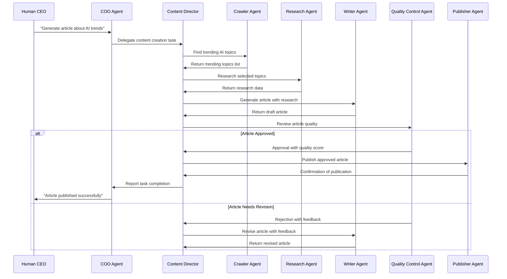
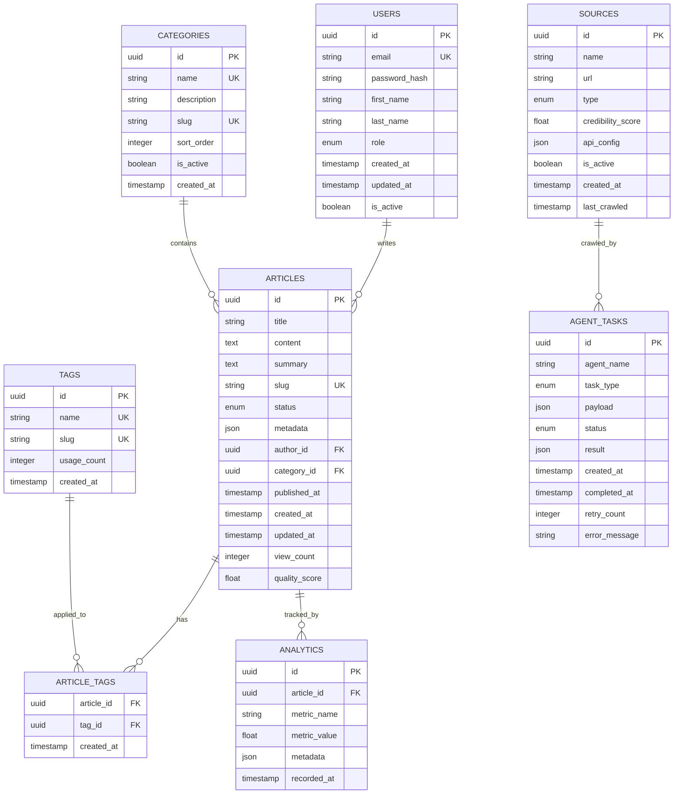
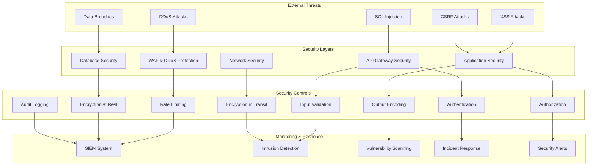
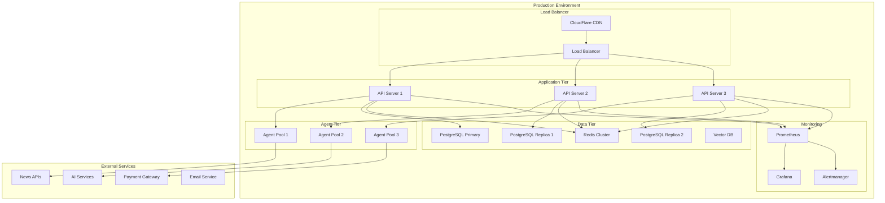
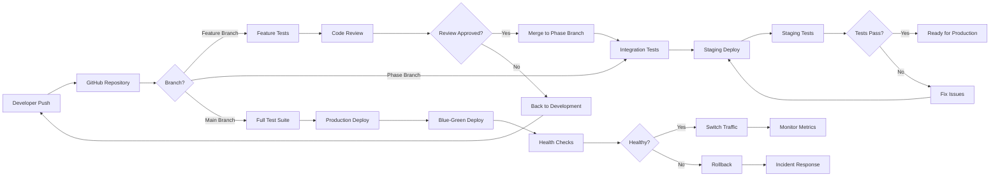

# DigitalTide - System Architecture Diagrams

## High-Level System Architecture

## AI Agent Communication Flow

## Content Creation Pipeline

```mermaid
flowchart LR
    subgraph "Discovery Phase"
        A[News Sources] --> B[Crawler Agent]
        B --> C[Trending Topics DB]
    end
    
    subgraph "Research Phase"
        C --> D[Research Agent]
        D --> E[External Sources]
        E --> D
        D --> F[Fact Verification DB]
    end
    
    subgraph "Creation Phase"
        F --> G[Writer Agent]
        G --> H[AI Models]
        H --> G
        G --> I[Draft Articles DB]
    end
    
    subgraph "Quality Phase"
        I --> J[Quality Control Agent]
        J --> K[Plagiarism Check]
        J --> L[Fact Check]
        J --> M[Brand Voice Check]
        K --> N{Approved?}
        L --> N
        M --> N
    end
    
    subgraph "Optimization Phase"
        N -->|Yes| O[SEO Agent]
        O --> P[Keyword Analysis]
        O --> Q[Meta Optimization]
        P --> R[Optimized Content]
        Q --> R
    end
    
    subgraph "Publication Phase"
        R --> S[Publisher Agent]
        S --> T[CMS/Website]
        S --> U[Social Media]
        S --> V[Newsletter]
    end
    
    subgraph "Analytics Phase"
        T --> W[Analytics Agent]
        U --> W
        V --> W
        W --> X[Performance Metrics]
        X --> Y[Feedback Loop]
        Y --> B
    end
    
    N -->|No| Z[Revision Queue]
    Z --> G
```

## Database Schema Overview

## Security Architecture

## Deployment Architecture

## CI/CD Pipeline

---

*These diagrams provide a visual representation of the DigitalTide architecture and can be rendered in GitHub, VS Code, and other Markdown-compatible viewers that support Mermaid diagrams.*